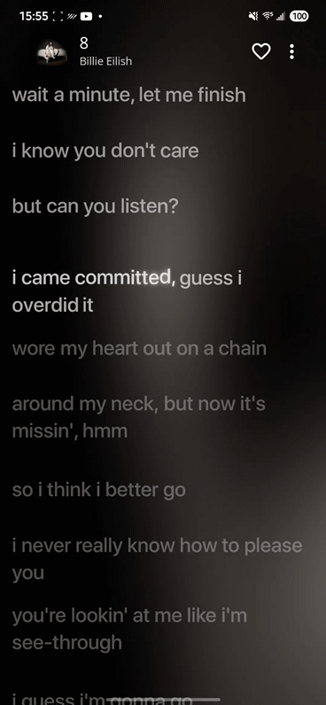

# Beautiful Lyrics Mobile

> [!WARNING]
> As of June 15, 2025, I will be leaving this project alone in favor of my new Xposed module, [Spotify Plus](https://github.com/LeNerd46/SpotifyPlus). Not only is it far more stable than this app, it works directly inside of Spotify, not a stand alone app. I see much more potential with this new project, and I think people will be more happy with it too. The API used to authenticate with Spotify will be shutting down as well, so if you wish to continue using this app, you will need to install v1.0.0-preview

Tired of Spotify's boring lyrics? Hate Musixmatch's inaccuracy and basicness? This project aims to fix that by making lyrics *beautiful*, heavily based on [beautiful-lyrics](https://github.com/surfbryce/beautiful-lyrics) by [@surfbryce](https://github.com/surfbryce)

## Description

What exactly is beautiful lyrics? This is a **companian** app to Spotify, intended to be used along side it (for now). Its main feature is "beat by beat" synced lyrics or karaoke lyrics. In layman's terms, instead of Spotify's line by line, this is more like syllable by syllable

## Getting Started

> [!NOTE]
> This is ONLY for Android, there is no iOS version. 

### Installing

- Head to the releases page and download the APK
- Install the APK and read the information there, it's important to understand how to set it up
- Check out setup.md. It will give you all the information on how to setup the app so that it works properly

## Help
- Not sure how to set up the developer app? Check out [setup.md](https://github.com/LeNerd46/beautiful-lyrics-mobile/blob/main/setup.md)

## Preview
Look, pretty videos and stuff! <small>(The gifs kind of lower the quality a bit)</small>

## License

This project is licensed under the MIT License - see the [LICENSE](https://github.com/LeNerd46/beautiful-lyrics-mobile/blob/main/LICENSE) file for details
